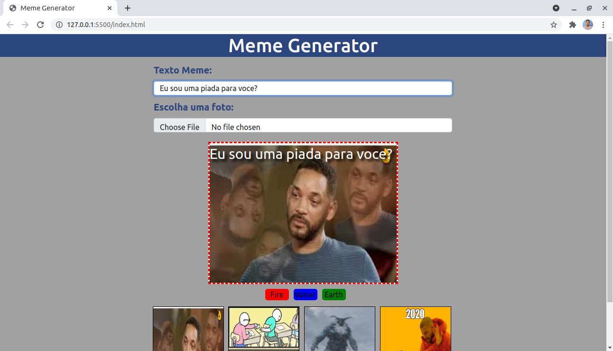

# Projeto-MEME-GENERATOR

Consiste em desenvolver uma página web onde seja possível criar memes, inserindo textos e imagens, os textos devem estar sobre as imagens.

## Requisitos
* Criar página HTML e estilizar com CSS
* Existir um *input* para texto e imagens
* Manipular o conteúdo da página via DOM quando ocorrer alguma inserção
* Fornecer 4 imagens modelos para memes

